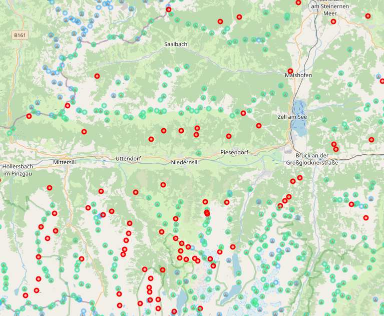
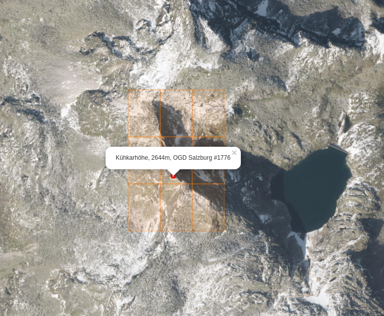
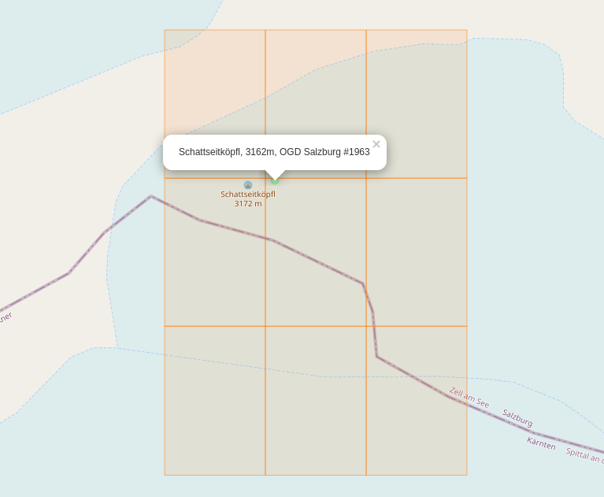

# Gipfel comparison tool

***************
[Open the APP in browser](https://www.tomas-dvorak.cz/gipfel/)
***************

This tool tries to compare two peak/saddle datasets:

* Open data from OGD Salzburg: https://service.salzburg.gv.at/ogd/client/showDetail/359c515c-4320-42ef-b4e5-88ba1bb03c2e
* Peak/saddle data from OpenStreetMap project, obtained via Overpass API: https://overpass-turbo.eu/s/Ts6


## Goal
My initial goal of this project is to extend the OSM dataset by peaks
available from the OGD Salzburg dataset. I want to identify such peaks that have 
* No close match in the OSM data
* Defined name and altitude in the OGD dataset




Blue dots are OSM data. Green dots are ODG peaks that have corresponding (close) OSM peek. 
Finally, red peaks are those from ODG that have no OSM entries. These should be examined 
and added to OpenStreetMap.

## ODG Salzburg coordinates system 
The GeoJSON from ODG uses *esriGeometryPoint* datatypes with `wkid:31258`. This defines
the projection and coordinates system. The EPSG:31258 projection is defined here: https://epsg.io/31258
and you can find conversion scripts here: https://spatialreference.org/ref/epsg/mgi-austria-gk-m31/

I am using [Proj4js](https://github.com/proj4js/proj4js) to transform coordinates to the WGS84 format, so following config is needed:

```js
Proj4js.defs["EPSG:31258"] = "+proj=tmerc +lat_0=0 +lon_0=13.33333333333333 +k=1 +x_0=450000 +y_0=-5000000 +ellps=bessel +towgs84=577.326,90.129,463.919,5.137,1.474,5.297,2.4232 +units=m +no_defs";
```

This projection configuration should be valid also for other ODG Salzburg datasets.

## How to detect matches
For each OSM peak/saddle I compute a [geohash](https://en.wikipedia.org/wiki/Geohash) ([js](https://github.com/chrisveness/latlon-geohash)) and all of its neighbours.
These geohashes are stored as discovered.

In next step, I iterate over all OGD peaks and check if its geohash matches any already
discovered. If not, they are marked as missing and should be added to OSM.



There are no OSM peaks in those 9 geohash squares around the Kühkarhöhe, which means this peak
is missing in the OSM dataset for sure.


On the following image you can see two matching datapoints



Even if they are not in the same geohash square, they are still detected as matches. 
This also provides some tweaking options - the current geohash precision is set to 7, 
which corresponds to real dimensions of 152.9m x 152.4m (at equator). Precision 8 would 
provide 38.2m x 19m  squares and higher precision mapping. This could, on the other hand,
lead to more false positives, if those peak points would be separated by a too large gap.
